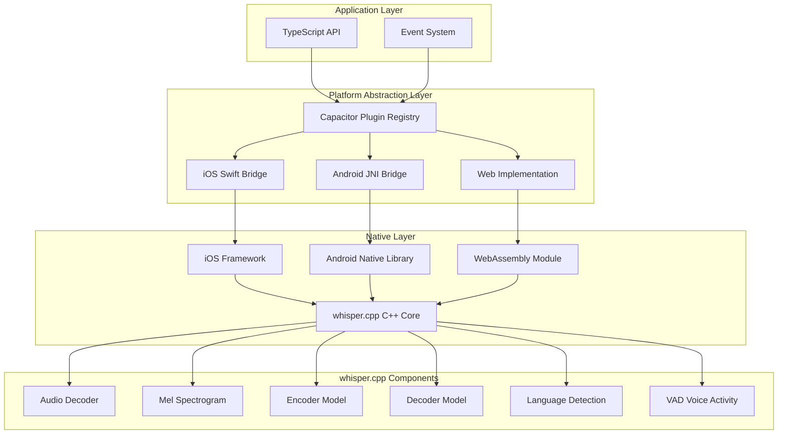
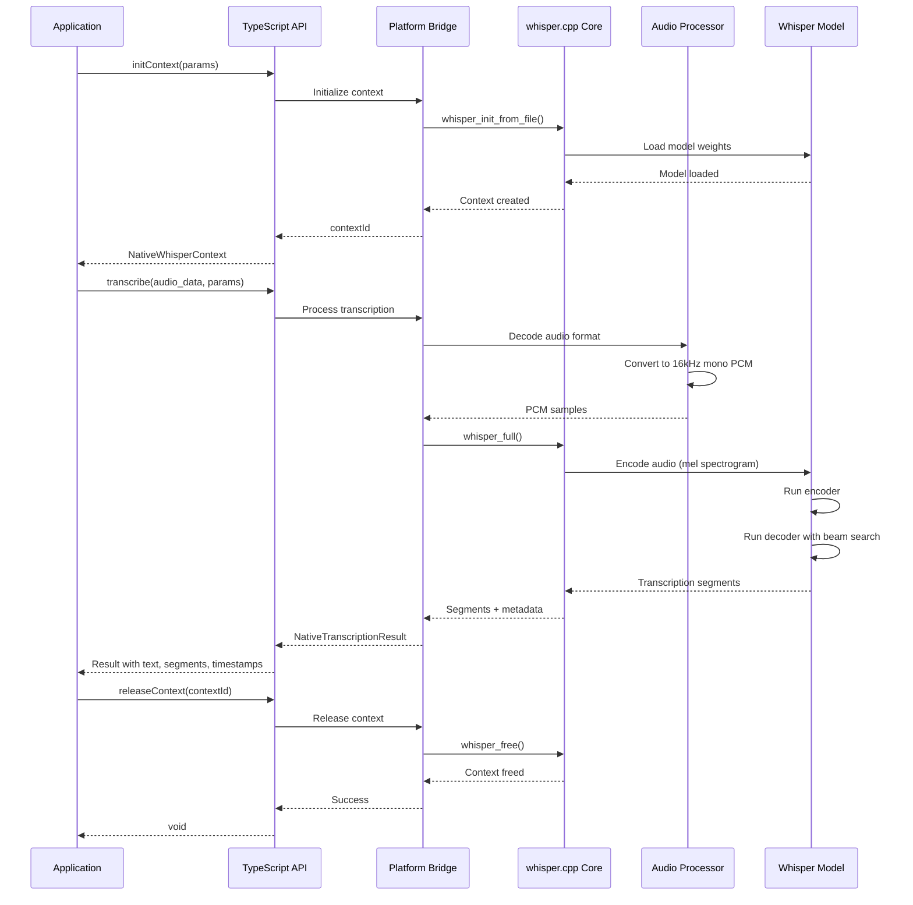

# Design Document: whisper-cpp-capacitor

## Overview

The whisper-cpp-capacitor plugin is a native Capacitor plugin that embeds whisper.cpp directly into mobile and web applications, enabling offline speech-to-text (STT) transcription with comprehensive support for audio processing, real-time streaming, language detection, and translation. This plugin follows the proven architecture of llama-cpp-capacitor, adapting it for whisper.cpp's audio processing capabilities across iOS, Android, and PWA (desktop browser) platforms.

The plugin provides a unified TypeScript API that abstracts platform-specific implementations while maintaining high performance through native code execution on mobile and WebAssembly on web platforms. It supports multiple audio formats, real-time transcription, speaker diarization, and advanced features like timestamps, word-level confidence scores, and multi-language support.

## Architecture

The plugin follows a three-tier architecture pattern proven in llama-cpp-capacitor:



## API Specifications

### Core Interfaces and Type Definitions

```typescript
export interface NativeWhisperContextParams {
  model: string;
  is_model_asset?: boolean;
  use_progress_callback?: boolean;
  n_threads?: number;
  n_max_text_ctx?: number;
  offset_ms?: number;
  duration_ms?: number;
  translate?: boolean;
  no_context?: boolean;
  no_timestamps?: boolean;
  single_segment?: boolean;
  language?: string;
  detect_language?: boolean;
  split_on_word?: boolean;
  max_len?: number;
  max_tokens?: number;
  speed_up?: boolean;
  audio_ctx?: number;
  initial_prompt?: string;
  prompt_tokens?: number[];
  prompt_n_tokens?: number;
  temperature?: number;
  temperature_inc?: number;
  entropy_thold?: number;
  logprob_thold?: number;
  no_speech_thold?: number;
  beam_size?: number;
  best_of?: number;
  use_gpu?: boolean;
  tdrz_enable?: boolean;
  token_timestamps?: boolean;
  thold_pt?: number;
  thold_ptsum?: number;
  max_context?: number;
  max_initial_ts?: number;
}

export interface NativeTranscribeParams {
  audio_data: string;
  is_audio_file?: boolean;
  params: NativeWhisperContextParams;
}

export interface WhisperSegment {
  start: number;
  end: number;
  text: string;
  tokens?: number[];
  speaker_id?: number;
  confidence?: number;
  no_speech_prob?: number;
}

export interface WhisperWord {
  word: string;
  start: number;
  end: number;
  confidence: number;
}

export interface NativeTranscriptionResult {
  text: string;
  segments: WhisperSegment[];
  words?: WhisperWord[];
  language: string;
  language_prob: number;
  duration_ms: number;
  processing_time_ms: number;
}

export interface NativeWhisperContext {
  contextId: number;
  model: {
    type: string;
    is_multilingual: boolean;
    vocab_size: number;
    n_audio_ctx: number;
    n_audio_state: number;
    n_audio_head: number;
    n_audio_layer: number;
    n_text_ctx: number;
    n_text_state: number;
    n_text_head: number;
    n_text_layer: number;
    n_mels: number;
    ftype: number;
  };
  gpu: boolean;
  reasonNoGPU: string;
}

export interface AudioFormat {
  sample_rate: number;
  channels: number;
  bits_per_sample: number;
  format: 'wav' | 'mp3' | 'ogg' | 'flac' | 'm4a' | 'webm';
}

export interface StreamingTranscribeParams {
  chunk_length_ms?: number;
  step_length_ms?: number;
  params: NativeWhisperContextParams;
}
```

### Main Plugin Interface

```typescript
export interface WhisperCppPlugin {
  initContext(params: NativeWhisperContextParams): Promise<NativeWhisperContext>;
  releaseContext(options: { contextId: number }): Promise<void>;
  releaseAllContexts(): Promise<void>;
  transcribe(params: NativeTranscribeParams): Promise<NativeTranscriptionResult>;
  transcribeRealtime(params: StreamingTranscribeParams): Promise<void>;
  stopTranscription(): Promise<void>;
  loadModel(options: { path: string; is_asset?: boolean }): Promise<void>;
  unloadModel(): Promise<void>;
  getModelInfo(): Promise<NativeWhisperContext['model']>;
  getAudioFormat(options: { path: string }): Promise<AudioFormat>;
  convertAudio(options: { input: string; output: string; target_format: AudioFormat }): Promise<void>;
  getSystemInfo(): Promise<{ platform: string; gpu_available: boolean; max_threads: number; memory_available_mb: number }>;
}
```

## Main Algorithm/Workflow



## Components and Interfaces

### Component 1: TypeScript API Layer
Provides the public API surface, handles parameter validation, manages event subscriptions, and maintains context lifecycle.

### Component 2: iOS Swift Bridge
Bridges TypeScript API to iOS native implementation using Swift and Objective-C++. Handles Metal GPU acceleration, AVFoundation audio processing, and background threading.

### Component 3: Android JNI Bridge
Bridges TypeScript API to Android native implementation using Java and JNI. Handles NDK compilation, audio decoding via MediaCodec, and GPU acceleration.

### Component 4: Web/PWA Implementation
Provides WebAssembly-based implementation for desktop browsers with Web Workers for background processing.

### Component 5: whisper.cpp Native Core (C++ wrapper)
C++ wrapper layer (cap-whisper.cpp/h) around whisper.cpp providing init, transcribe, model info, and cleanup functions.

## Error Handling

- ModelLoadError: Model file not found, corrupted, or incompatible
- AudioProcessingError: Invalid audio format, unsupported codec, corrupted data
- OutOfMemoryError: Insufficient memory for model or audio processing
- GPU Initialization Failure: Log warning, fall back to CPU
- TranscriptionTimeoutError: Return partial results if available
- ContextNotFoundError: Operation on non-existent or released context

## Performance Considerations

- Model sizes: tiny (75MB), base (142MB), small (466MB), medium (1.5GB), large (3GB)
- GPU acceleration: Metal on iOS (2-3x speedup), OpenCL/Vulkan on Android, WebGPU on web
- Optimization: quantized models (Q4/Q5), thread count tuning, audio preprocessing, circular buffers for streaming

## Security Considerations

- All audio processing on-device (no network transmission)
- Audio buffer cleanup after processing
- Platform permission management for microphone access
- Model integrity verification

## Dependencies

- whisper.cpp (C++ core), Capacitor v8+, TypeScript 5+
- iOS: Xcode 14+, Swift 5.7+, iOS 13+, AVFoundation, Metal
- Android: NDK r25+, API 24+, Gradle 8+
- Web: Emscripten 3.1+, Web Audio API, Web Workers
- Build: CMake 3.20+, Node.js 18+, Rollup, Jest
