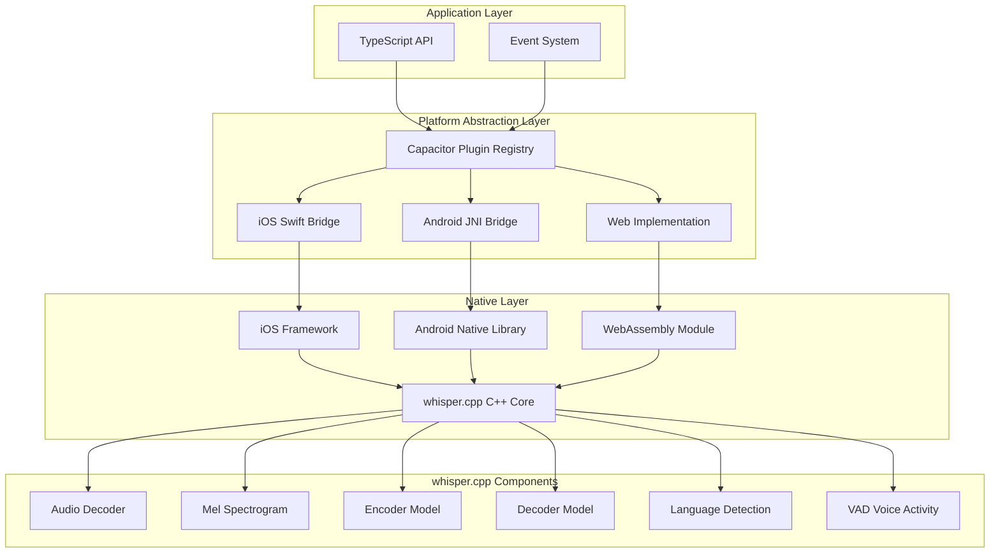
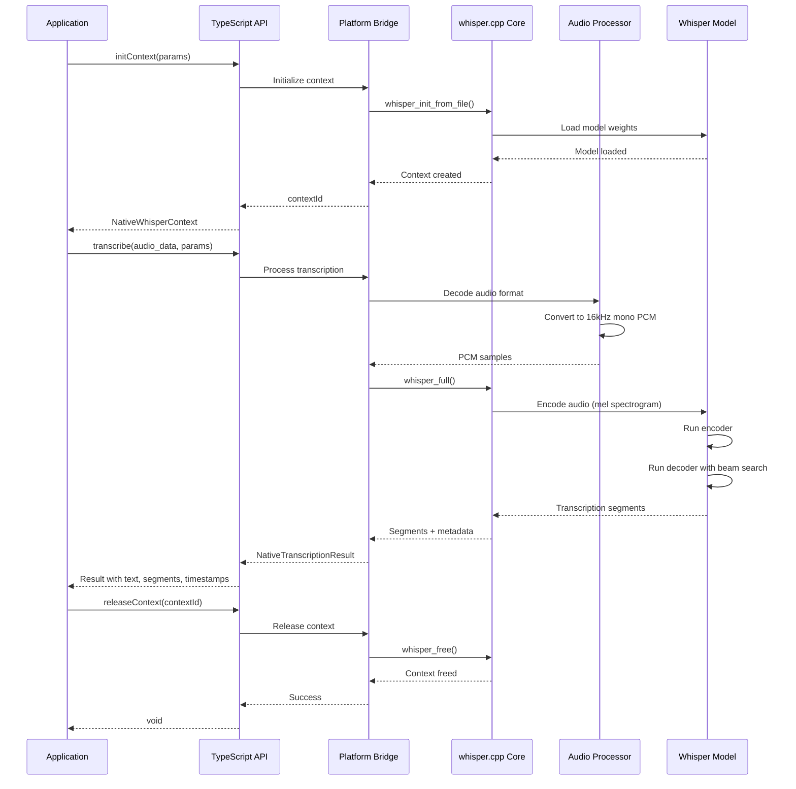

# Design Document: whisper-cpp-capacitor

## Overview

The whisper-cpp-capacitor plugin is a native Capacitor plugin that embeds whisper.cpp directly into mobile and web applications, enabling offline speech-to-text (STT) transcription with comprehensive support for audio processing, real-time streaming, language detection, and translation. This plugin follows the proven architecture of llama-cpp-capacitor, adapting it for whisper.cpp's audio processing capabilities across iOS, Android, and PWA (desktop browser) platforms.

The plugin provides a unified TypeScript API that abstracts platform-specific implementations while maintaining high performance through native code execution on mobile and WebAssembly on web platforms. It supports multiple audio formats, real-time transcription, speaker diarization, and advanced features like timestamps, word-level confidence scores, and multi-language support.

## Architecture

The plugin follows a three-tier architecture pattern proven in llama-cpp-capacitor:



## API Specifications

### Core Interfaces and Type Definitions

```typescript
// Native parameter types matching whisper.cpp API
export interface NativeWhisperContextParams {
  model: string;
  is_model_asset?: boolean;
  use_progress_callback?: boolean;
  
  // Core whisper parameters
  n_threads?: number;
  n_max_text_ctx?: number;
  offset_ms?: number;
  duration_ms?: number;
  
  // Translation and language
  translate?: boolean;
  no_context?: boolean;
  no_timestamps?: boolean;
  single_segment?: boolean;
  
  // Language detection
  language?: string;
  detect_language?: boolean;
  
  // Advanced features
  split_on_word?: boolean;
  max_len?: number;
  max_tokens?: number;
  
  // Audio processing
  speed_up?: boolean;
  audio_ctx?: number;
  
  // Prompts and context
  initial_prompt?: string;
  prompt_tokens?: number[];
  prompt_n_tokens?: number;
  
  // Sampling parameters
  temperature?: number;
  temperature_inc?: number;
  entropy_thold?: number;
  logprob_thold?: number;
  no_speech_thold?: number;
  
  // Beam search
  beam_size?: number;
  best_of?: number;
  
  // GPU acceleration (iOS Metal)
  use_gpu?: boolean;
  
  // Speaker diarization
  tdrz_enable?: boolean;
  
  // Timestamps
  token_timestamps?: boolean;
  thold_pt?: number;
  thold_ptsum?: number;
  max_context?: number;
  max_initial_ts?: number;
}

export interface NativeTranscribeParams {
  audio_data: string; // Base64 encoded audio or file path
  is_audio_file?: boolean;
  params: NativeWhisperContextParams;
}

export interface WhisperSegment {
  start: number; // Start time in milliseconds
  end: number; // End time in milliseconds
  text: string;
  tokens?: number[];
  speaker_id?: number; // For diarization
  confidence?: number;
  no_speech_prob?: number;
}

export interface WhisperWord {
  word: string;
  start: number;
  end: number;
  confidence: number;
}

export interface NativeTranscriptionResult {
  text: string;
  segments: WhisperSegment[];
  words?: WhisperWord[];
  language: string;
  language_prob: number;
  duration_ms: number;
  processing_time_ms: number;
}

export interface NativeWhisperContext {
  contextId: number;
  model: {
    type: string; // tiny, base, small, medium, large
    is_multilingual: boolean;
    vocab_size: number;
    n_audio_ctx: number;
    n_audio_state: number;
    n_audio_head: number;
    n_audio_layer: number;
    n_text_ctx: number;
    n_text_state: number;
    n_text_head: number;
    n_text_layer: number;
    n_mels: number;
    ftype: number;
  };
  gpu: boolean;
  reasonNoGPU: string;
}

export interface AudioFormat {
  sample_rate: number;
  channels: number;
  bits_per_sample: number;
  format: 'wav' | 'mp3' | 'ogg' | 'flac' | 'm4a' | 'webm';
}

export interface StreamingTranscribeParams {
  chunk_length_ms?: number; // Default: 30000 (30 seconds)
  step_length_ms?: number; // Default: 5000 (5 seconds)
  params: NativeWhisperContextParams;
}
```

### Main Plugin Interface

```typescript
export interface WhisperCppPlugin {
  // Context management
  initContext(params: NativeWhisperContextParams): Promise<NativeWhisperContext>;
  releaseContext(options: { contextId: number }): Promise<void>;
  releaseAllContexts(): Promise<void>;
  
  // Transcription
  transcribe(params: NativeTranscribeParams): Promise<NativeTranscriptionResult>;
  transcribeRealtime(params: StreamingTranscribeParams): Promise<void>;
  stopTranscription(): Promise<void>;
  
  // Model management
  loadModel(options: { path: string; is_asset?: boolean }): Promise<void>;
  unloadModel(): Promise<void>;
  getModelInfo(): Promise<NativeWhisperContext['model']>;
  
  // Audio utilities
  getAudioFormat(options: { path: string }): Promise<AudioFormat>;
  convertAudio(options: { 
    input: string; 
    output: string; 
    target_format: AudioFormat 
  }): Promise<void>;
  
  // System info
  getSystemInfo(): Promise<{
    platform: string;
    gpu_available: boolean;
    max_threads: number;
    memory_available_mb: number;
  }>;
}
```

## Main Algorithm/Workflow



## Components and Interfaces

### Component 1: TypeScript API Layer

**Purpose**: Provides the public API surface for applications, handles parameter validation, and manages event subscriptions.

**Interface**:
```typescript
export class WhisperCpp {
  // Singleton instance
  static getInstance(): WhisperCpp;
  
  // Context management
  async initContext(params: NativeWhisperContextParams): Promise<NativeWhisperContext>;
  async releaseContext(contextId: number): Promise<void>;
  async releaseAllContexts(): Promise<void>;
  
  // Transcription
  async transcribe(params: NativeTranscribeParams): Promise<NativeTranscriptionResult>;
  async transcribeRealtime(params: StreamingTranscribeParams): Promise<void>;
  async stopTranscription(): Promise<void>;
  
  // Event handling
  on(event: 'progress' | 'segment' | 'error', callback: Function): void;
  off(event: string, callback: Function): void;
  
  // Utilities
  async getSystemInfo(): Promise<SystemInfo>;
  async getModelInfo(): Promise<ModelInfo>;
}
```

**Responsibilities**:
- Validate input parameters before passing to native layer
- Convert between TypeScript types and native types
- Manage event listeners and callbacks
- Handle errors and provide meaningful error messages
- Maintain context lifecycle

### Component 2: iOS Swift Bridge

**Purpose**: Bridges TypeScript API to iOS native implementation using Swift and Objective-C++.

**Interface**:
```swift
@objc(WhisperCppPlugin)
public class WhisperCppPlugin: CAPPlugin {
    @objc func initContext(_ call: CAPPluginCall)
    @objc func releaseContext(_ call: CAPPluginCall)
    @objc func releaseAllContexts(_ call: CAPPluginCall)
    @objc func transcribe(_ call: CAPPluginCall)
    @objc func transcribeRealtime(_ call: CAPPluginCall)
    @objc func stopTranscription(_ call: CAPPluginCall)
    @objc func getSystemInfo(_ call: CAPPluginCall)
    @objc func getModelInfo(_ call: CAPPluginCall)
}
```

**Responsibilities**:
- Convert Capacitor plugin calls to native Swift/C++ calls
- Manage whisper.cpp context lifecycle
- Handle file I/O for models and audio files
- Implement Metal GPU acceleration on iOS
- Manage background processing and threading
- Send progress events back to JavaScript

### Component 3: Android JNI Bridge

**Purpose**: Bridges TypeScript API to Android native implementation using Kotlin and JNI.

**Interface**:
```kotlin
@CapacitorPlugin(name = "WhisperCpp")
class WhisperCppPlugin : Plugin() {
    @PluginMethod
    fun initContext(call: PluginCall)
    
    @PluginMethod
    fun releaseContext(call: PluginCall)
    
    @PluginMethod
    fun releaseAllContexts(call: PluginCall)
    
    @PluginMethod
    fun transcribe(call: PluginCall)
    
    @PluginMethod
    fun transcribeRealtime(call: PluginCall)
    
    @PluginMethod
    fun stopTranscription(call: PluginCall)
    
    @PluginMethod
    fun getSystemInfo(call: PluginCall)
    
    @PluginMethod
    fun getModelInfo(call: PluginCall)
}
```

**Responsibilities**:
- Convert Capacitor plugin calls to JNI calls
- Manage whisper.cpp context lifecycle via JNI
- Handle Android-specific file paths and permissions
- Implement GPU acceleration using OpenCL/Vulkan if available
- Manage threading and async operations
- Send progress events back to JavaScript

### Component 4: Web/PWA Implementation

**Purpose**: Provides WebAssembly-based implementation for desktop browsers.

**Interface**:
```typescript
export class WhisperCppWeb extends WebPlugin implements WhisperCppPlugin {
  async initContext(params: NativeWhisperContextParams): Promise<NativeWhisperContext>;
  async releaseContext(options: { contextId: number }): Promise<void>;
  async transcribe(params: NativeTranscribeParams): Promise<NativeTranscriptionResult>;
  // ... other methods
}
```

**Responsibilities**:
- Load and initialize WebAssembly module
- Manage memory between JavaScript and WASM
- Handle audio decoding in browser
- Implement Web Workers for background processing
- Provide fallback implementations for unsupported features

### Component 5: whisper.cpp Native Core

**Purpose**: Core C++ implementation providing speech-to-text functionality.

**Interface** (C API):
```c
struct whisper_context* whisper_init_from_file(const char* path_model);
void whisper_free(struct whisper_context* ctx);

int whisper_full(
    struct whisper_context* ctx,
    struct whisper_full_params params,
    const float* samples,
    int n_samples
);

int whisper_full_n_segments(struct whisper_context* ctx);
const char* whisper_full_get_segment_text(struct whisper_context* ctx, int i_segment);
int64_t whisper_full_get_segment_t0(struct whisper_context* ctx, int i_segment);
int64_t whisper_full_get_segment_t1(struct whisper_context* ctx, int i_segment);

int whisper_full_lang_id(struct whisper_context* ctx);
const char* whisper_lang_str(int id);
```

**Responsibilities**:
- Load and manage Whisper model weights
- Process audio samples (mel spectrogram generation)
- Run encoder and decoder neural networks
- Perform beam search for optimal transcription
- Detect language and speaker changes
- Generate timestamps and confidence scores

## Data Models

### WhisperContext

```typescript
interface WhisperContext {
  contextId: number;
  modelPath: string;
  isAsset: boolean;
  params: NativeWhisperContextParams;
  model: {
    type: 'tiny' | 'base' | 'small' | 'medium' | 'large';
    is_multilingual: boolean;
    vocab_size: number;
    n_audio_ctx: number;
    n_audio_state: number;
    n_audio_head: number;
    n_audio_layer: number;
    n_text_ctx: number;
    n_text_state: number;
    n_text_head: number;
    n_text_layer: number;
    n_mels: number;
    ftype: number;
  };
  gpu: boolean;
  reasonNoGPU: string;
  createdAt: number;
}
```

**Validation Rules**:
- contextId must be unique positive integer
- modelPath must be valid file path or asset reference
- model type must match actual loaded model
- gpu flag must reflect actual hardware capability

### TranscriptionResult

```typescript
interface TranscriptionResult {
  text: string;
  segments: WhisperSegment[];
  words?: WhisperWord[];
  language: string;
  language_prob: number;
  duration_ms: number;
  processing_time_ms: number;
  metadata: {
    model_type: string;
    sample_rate: number;
    channels: number;
    gpu_used: boolean;
  };
}
```

**Validation Rules**:
- text must not be null (can be empty string)
- segments array must be ordered by start time
- segment times must be non-negative and end >= start
- language must be valid ISO 639-1 code
- language_prob must be between 0 and 1
- duration_ms and processing_time_ms must be non-negative

### AudioData

```typescript
interface AudioData {
  samples: Float32Array;
  sample_rate: number;
  channels: number;
  duration_ms: number;
  format: AudioFormat;
}
```

**Validation Rules**:
- samples must be valid Float32Array
- sample_rate must be positive (typically 16000 for Whisper)
- channels must be 1 (mono) or 2 (stereo)
- duration_ms must match samples.length / sample_rate
- format must be supported audio format

## Error Handling

### Error Scenario 1: Model Loading Failure

**Condition**: Model file not found, corrupted, or incompatible format
**Response**: Throw `ModelLoadError` with descriptive message
**Recovery**: 
- Verify model file exists and is readable
- Check model format compatibility
- Suggest re-downloading model
- Provide fallback to smaller model if available

### Error Scenario 2: Audio Processing Failure

**Condition**: Invalid audio format, unsupported codec, or corrupted audio data
**Response**: Throw `AudioProcessingError` with details about the issue
**Recovery**:
- Attempt audio format conversion
- Validate audio file integrity
- Provide supported format list to user
- Fall back to raw PCM if possible

### Error Scenario 3: Out of Memory

**Condition**: Insufficient memory for model or audio processing
**Response**: Throw `OutOfMemoryError` with memory requirements
**Recovery**:
- Release unused contexts
- Suggest using smaller model
- Reduce audio chunk size for streaming
- Clear audio buffer cache

### Error Scenario 4: GPU Initialization Failure

**Condition**: GPU acceleration requested but not available or initialization failed
**Response**: Log warning and fall back to CPU processing
**Recovery**:
- Continue with CPU processing
- Set gpu flag to false in context
- Populate reasonNoGPU with explanation
- Notify user of performance impact

### Error Scenario 5: Transcription Timeout

**Condition**: Transcription takes longer than expected (e.g., very long audio)
**Response**: Throw `TranscriptionTimeoutError` with partial results if available
**Recovery**:
- Return partial transcription if segments available
- Suggest splitting audio into smaller chunks
- Increase timeout threshold
- Use streaming mode for long audio

### Error Scenario 6: Context Not Found

**Condition**: Operation attempted on non-existent or released context
**Response**: Throw `ContextNotFoundError` with contextId
**Recovery**:
- Verify context was initialized
- Check if context was already released
- Re-initialize context if needed
- Maintain context registry for debugging

## Testing Strategy

### Unit Testing Approach

**Objective**: Verify individual components work correctly in isolation

**Key Test Cases**:
1. **API Layer Tests**:
   - Parameter validation (valid/invalid inputs)
   - Type conversions (TypeScript ↔ Native)
   - Event emission and subscription
   - Error handling and propagation

2. **Bridge Layer Tests**:
   - Platform detection and routing
   - Native method invocation
   - Callback handling
   - Memory management

3. **Native Layer Tests**:
   - Model loading (valid/invalid models)
   - Audio processing (various formats)
   - Transcription accuracy (known audio samples)
   - Context lifecycle management

**Coverage Goals**: 80%+ code coverage for TypeScript layer, critical path coverage for native code

**Tools**: Jest for TypeScript, XCTest for iOS, JUnit for Android

### Property-Based Testing Approach

**Objective**: Verify system behavior holds for wide range of inputs

**Property Test Library**: fast-check (TypeScript), SwiftCheck (iOS), kotlinx.test (Android)

**Key Properties**:
1. **Idempotency**: Multiple transcriptions of same audio produce same result
2. **Monotonicity**: Segment timestamps are strictly increasing
3. **Consistency**: Text concatenation of segments equals full text
4. **Reversibility**: Language detection is consistent across multiple runs
5. **Boundary Conditions**: Empty audio, very short audio, very long audio handled gracefully

**Example Property Test**:
```typescript
import fc from 'fast-check';

test('segment timestamps are monotonically increasing', async () => {
  await fc.assert(
    fc.asyncProperty(
      fc.array(fc.float({ min: 0, max: 1000 }), { minLength: 16000 }), // Audio samples
      async (samples) => {
        const result = await transcribe({ audio_data: samples, ... });
        for (let i = 1; i < result.segments.length; i++) {
          expect(result.segments[i].start).toBeGreaterThanOrEqual(
            result.segments[i - 1].end
          );
        }
      }
    )
  );
});
```

### Integration Testing Approach

**Objective**: Verify end-to-end workflows across all platforms

**Key Integration Tests**:
1. **Full Transcription Workflow**:
   - Initialize context → Load model → Transcribe audio → Release context
   - Verify result accuracy against known transcriptions
   - Test on iOS, Android, and Web platforms

2. **Streaming Transcription**:
   - Initialize → Start streaming → Process chunks → Stop → Verify results
   - Test with various chunk sizes and overlap settings

3. **Multi-Context Management**:
   - Create multiple contexts with different models
   - Perform concurrent transcriptions
   - Verify no context interference
   - Release all contexts and verify cleanup

4. **Error Recovery**:
   - Trigger various error conditions
   - Verify graceful degradation
   - Test recovery mechanisms

5. **Platform-Specific Features**:
   - iOS Metal GPU acceleration
   - Android GPU acceleration
   - Web Worker threading

**Test Environment**: Real devices (iOS/Android) and desktop browsers (Chrome, Firefox, Safari)

## Performance Considerations

### Model Size vs. Accuracy Trade-offs

- **tiny**: 75 MB, fastest, suitable for real-time on mobile
- **base**: 142 MB, good balance for mobile apps
- **small**: 466 MB, better accuracy, slower on mobile
- **medium**: 1.5 GB, high accuracy, desktop/server only
- **large**: 3 GB, best accuracy, desktop/server only

**Recommendation**: Default to `base` for mobile, `small` for desktop

### Memory Management

- **Model Loading**: Models loaded once and reused across transcriptions
- **Audio Buffering**: Streaming mode uses circular buffer to limit memory
- **Context Pooling**: Reuse contexts when possible to avoid reload overhead
- **Garbage Collection**: Explicit context release to prevent memory leaks

### GPU Acceleration

- **iOS**: Metal acceleration provides 2-3x speedup on iPhone 12+
- **Android**: OpenCL/Vulkan support varies by device, test before enabling
- **Web**: WebGPU support experimental, fallback to CPU

### Optimization Strategies

1. **Quantization**: Use quantized models (Q4, Q5) for 50% size reduction with minimal accuracy loss
2. **Batch Processing**: Process multiple audio files in sequence with single model load
3. **Chunk Size Tuning**: Balance between latency and accuracy in streaming mode
4. **Thread Count**: Optimize n_threads based on device CPU cores
5. **Audio Preprocessing**: Resample and convert audio format before passing to native layer

## Security Considerations

### Model Integrity

- **Threat**: Malicious model files could execute arbitrary code
- **Mitigation**: 
  - Verify model checksums before loading
  - Load models only from trusted sources
  - Sandbox model execution environment
  - Validate model format and structure

### Audio Data Privacy

- **Threat**: Sensitive audio data could be leaked or intercepted
- **Mitigation**:
  - Process audio entirely on-device (no cloud transmission)
  - Clear audio buffers after processing
  - Provide option to disable audio logging
  - Encrypt audio files at rest if stored

### Memory Safety

- **Threat**: Buffer overflows or memory corruption in native code
- **Mitigation**:
  - Use safe memory allocation patterns
  - Validate array bounds before access
  - Use RAII patterns for resource management
  - Enable address sanitizer in debug builds

### Permission Management

- **Threat**: Unauthorized access to microphone or file system
- **Mitigation**:
  - Request permissions explicitly before audio access
  - Respect platform permission models (iOS/Android)
  - Provide clear permission rationale to users
  - Fail gracefully if permissions denied

## Dependencies

### Core Dependencies

- **whisper.cpp**: Core speech-to-text engine (C++)
- **Capacitor**: Cross-platform plugin framework (v5+)
- **TypeScript**: Type-safe API layer (v4.9+)

### Platform-Specific Dependencies

**iOS**:
- Xcode 14+
- Swift 5.7+
- iOS 13+ deployment target
- Accelerate framework (for Metal GPU)
- AVFoundation (for audio processing)

**Android**:
- Android Studio 2022+
- Kotlin 1.8+
- Android API 24+ (Android 7.0+)
- NDK r25+
- Gradle 8+

**Web**:
- Emscripten 3.1+ (for WebAssembly compilation)
- Modern browser with WebAssembly support
- Web Workers API
- Web Audio API

### Build Dependencies

- CMake 3.20+ (for native builds)
- Node.js 18+ and npm 9+
- Rollup (for TypeScript bundling)
- Jest (for testing)

### Optional Dependencies

- **fast-check**: Property-based testing
- **ffmpeg**: Audio format conversion (if not using native decoders)
- **Metal Performance Shaders**: iOS GPU optimization
- **OpenCL/Vulkan**: Android GPU acceleration
